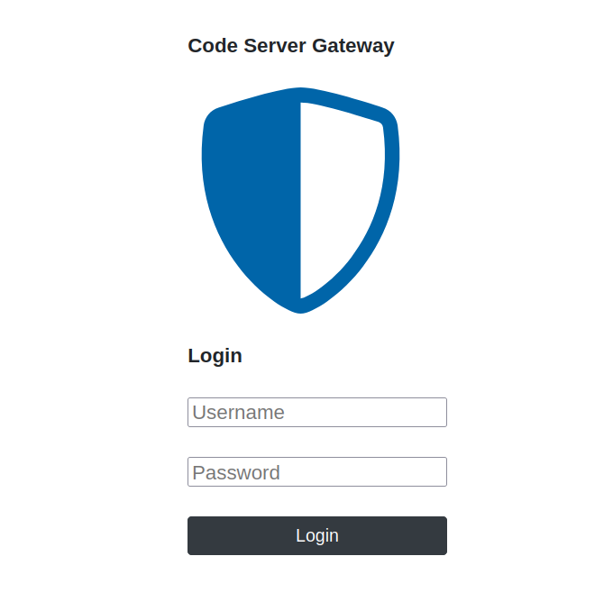
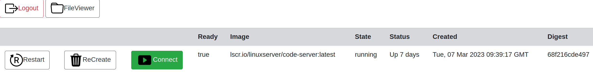

# Code Server Gateway

Code-Server-Gateway is a multiuser gateway/frontend for coder/code-server(VS code in the browser)

Pros
- Support LDAP
- Support ACME with support for own CA-root certificate

### Login page with LDAP support

### Tool menu with support for restarting and recreating code-server

